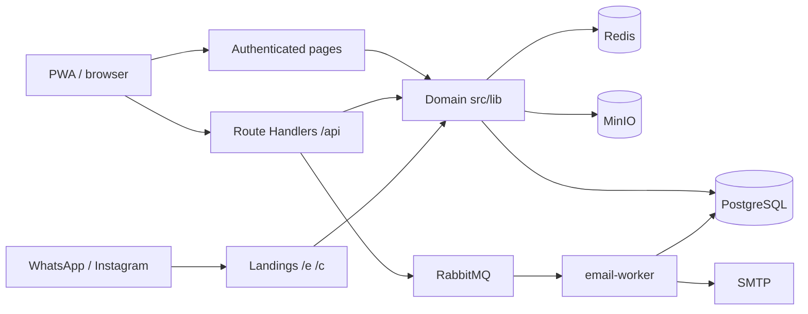
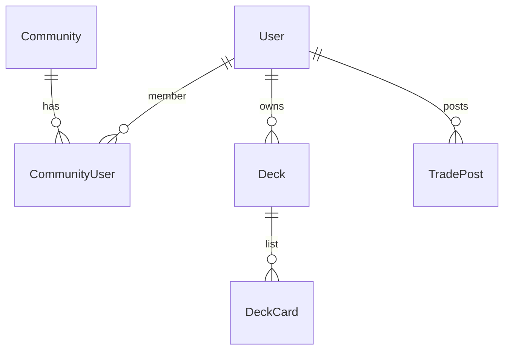
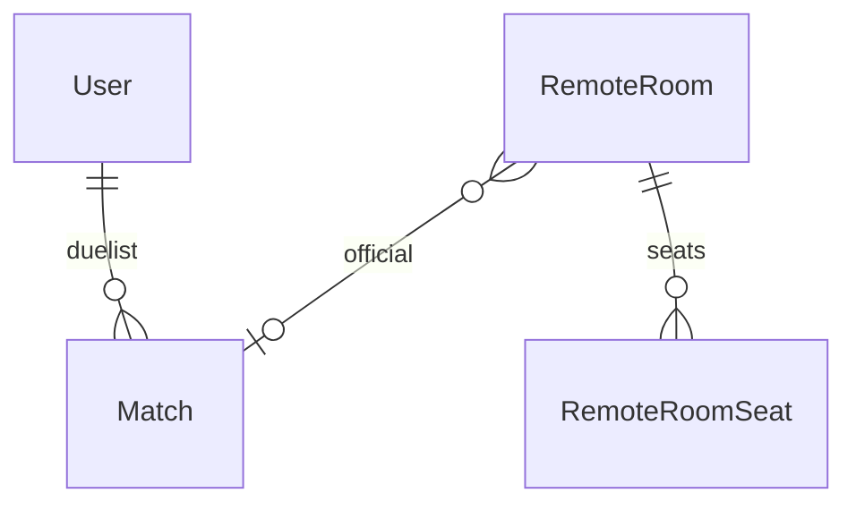
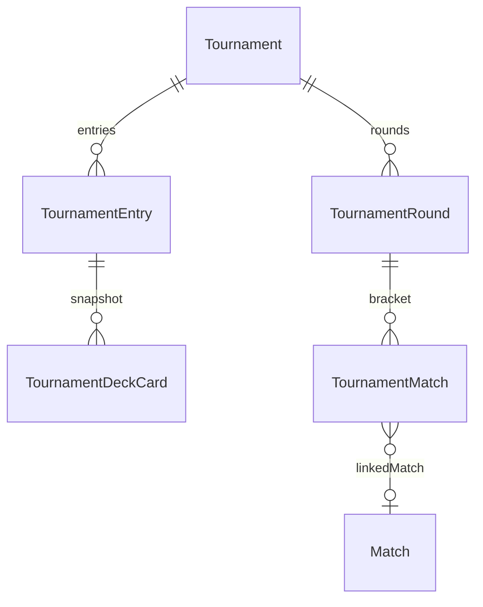

# YGO / HUB

Community hub for Yu-Gi-Oh! in Cajazeiras, Brazil. The local table used to coordinate Saturday at Bob’s, decks, cards, and tournaments in WhatsApp threads. I shipped a platform with accounts, profiles, and history — from Saturday RSVP to the tournament bracket — for players, organizers, and people who have not joined yet.

- Live: [yugiohcz.alttabcorp.com.br](https://yugiohcz.alttabcorp.com.br)
- Saturday invite: [yugiohcz.alttabcorp.com.br/e/sabado](https://yugiohcz.alttabcorp.com.br/e/sabado)
- Repository: [GitHub](https://github.com/Alttabcorp/yugioh_community)

---

## Product summary

YGO / HUB is a full-stack product in production for a local community. It is not a portfolio CRUD: people use it on their phones, in the group chat, and at the store.

**Problem.** Saturday attendance, decklists, card ads, duels, and tournaments lived in threads. Anyone outside the group did not exist. Organizers had no list, payment proof, or bracket. Match results never became a ranking.

**What shipped.** An authenticated hub (PWA) plus public landings `/e` (meetup) and `/c` (tournament) with Open Graph for WhatsApp and Instagram. Accounts via email, Google, or Discord. RSVP, TCG decks, collection, marketplace, in-person matches, **remote rooms** (P2P camera, best-of-3, mutual confirmation), and tournaments with registration, banlist, PIX, check-in, and podium.

| Role | What they do |
|---|---|
| Player | Saturday RSVP, build a deck, duel in person or remote, trade, enter events |
| Organizer (plan) | Create tournaments, approve entries, generate the bracket, TV view |
| Master | `/admin`: members, bans, listings, reports, plans, audit log |
| Visitor | Public invite with no login; sign up afterwards |

---

## What the system does

- Recurring Saturday event at Bob’s, with RSVP and the confirmed list
- Board for other in-person meetups
- Public `/e` and `/c` landings to share on WhatsApp and Instagram
- Deck builder (main 40–60, extra/side 15, TCG/OCG/GOAT banlist), collection, YDK import
- Marketplace for sale, trade, and wanted posts, with MinIO media, chat, favorites, alerts, reputation
- In-person matches and **remote rooms**: WebRTC, LP, dice, coin, best-of-3
- Match history, highlights, and community ranking
- Tournaments: fee/PIX, locked decklist, check-in, bracket, podium
- Accounts, profile (LGPD opt-in), in-app + email notifications, installable PWA (Serwist)

Add screenshots under `fotos/` and reference them here — home, Saturday RSVP, deck builder, remote room, or tournament bracket.

---

## System architecture

Next.js App Router in one repo: UI, Route Handlers, and domain TypeScript. PostgreSQL (Prisma) for durable data. Redis for live duel state and pub/sub. Email via RabbitMQ. Files on MinIO (S3). Docker on Coolify.

Pages and APIs call `src/lib/*`. Prisma and Redis stay out of UI components. Competitive deck validation (`validateDeckForTournament`) is shared by tournaments and remote duels.

### Stack

| Layer | Technology |
|---|---|
| Application | TypeScript, Next.js 16 (App Router), React 19 |
| Auth | Better Auth (email, Google, Discord), community roles |
| Data | Prisma 7, PostgreSQL, `pg` adapter |
| Realtime | Redis (ioredis), SSE, WebRTC in remote rooms |
| Queues and email | RabbitMQ, `scripts/email-worker.ts`, Nodemailer |
| Files | MinIO / S3 |
| Client | PWA (Serwist) |
| Deploy | Docker Compose: app, email-worker, postgres, redis, rabbitmq, minio |

### Auth, roles, and plans

- Session via Better Auth (`Account`, `Session`, `Verification`).
- Verified email (`requireVerifiedEmail`) gates marketplace, tournament entry, and **remote player seats**.
- Bans (`User.bannedAt`) return 403 from `requireAuthenticatedUser`.
- `CommunityUser.role`: PLAYER, ADMIN, MASTER. MASTER owns `/admin` and `AdminAuditLog`.
- `Plan` / `UserPlan` / `PlanAccessRequest`: organizer capability is granted, not charged automatically.

The authenticated hub stays separate from public invite pages.

---

## Data model (PostgreSQL)

Source: `prisma/schema.prisma`. `cuid` ids. Business enums stored as `String`.

**Identity, decks, and market**

**Events, matches, and remote rooms**

**Tournaments**

**Identity:** `User`, Better Auth tables, `Community` / `CommunityUser`, plans, `Notification`, `AdminAuditLog`.

**Events:** `MeetupEvent`, `Attendance`, `Match` (IN_PERSON/REMOTE, format, scores, A/B confirmation, deck JSON snapshots), `DuelInvite` + chat.

**Decks:** `Deck` (`format`, `isTournamentCopy`, `archivedAt`), `DeckCard` PK `(deckId, cardId, section)`, `CollectionCard`.

**Market:** `TradePost`, media, comments, reports, favorites, chat, `SellerRating`, `CardWantAlert`.

**Tournaments:** `Tournament`, `TournamentEntry` (PENDING/APPROVED, PIX proof, check-in, swiss, podium), `TournamentDeckCard` snapshot, `TournamentRound` / `TournamentMatch` (`linkedMatchId` → `Match`).

**Remote rooms (Postgres):** `RemoteRoom` (6-char code, LOBBY/PLAYING/CLOSED, scrypt password, 6h TTL, `matchId`), `RemoteRoomSeat` (PLAYER/SPECTATOR, side, deck, ready), `RemoteDuelReport`.

**Remote rooms (Redis, ~6h TTL, 90s presence):**

| Key | Content |
|---|---|
| `remote:room:{id}:tools` | LP, dice, coin, game score, series confirms |
| `remote:room:{id}:proposal` | cancel / win / undo waiting for the other player |
| `remote:room:{id}:history` | wins and cancels in the room |
| `remote:room:{id}:chat` | spectator chat |
| `remote:room:{id}:player:{userId}` | duelist presence |
| channel `remote:room:{id}` | pub/sub → SSE `/api/remotos/rooms/[id]/stream` |

WebRTC is P2P; the server only relays signaling.

---

## Competitive rules (tournament = remote player)

Sitting as a **remote duelist** uses the **same account and deck rules** as a TCG tournament entry:

| Rule | Tournament | Remote duel |
|---|---|---|
| Verified email | yes | yes (create room, sit, deck, ready, start) |
| Not banned | yes | yes |
| TCG format | tournament format | TCG (`COMPETITIVE_PLAY_FORMAT`) |
| Main 40–60, extra/side ≤ 15 | `validateDeckForTournament` | same |
| Format banlist | yes | yes |
| Own active deck, not a tournament copy | yes | yes |
| Fee / PIX proof | if the event charges | no |
| Organizer approval | yes | no |
| Check-in / bracket | yes | no |

Spectators do not need a verified email. Fees and brackets stay in the tournament module.

---

## Remote duel flow

1. Host creates a LOBBY room (optional password).
2. Both players sit, pick a legal TCG deck, ready up.
3. Start creates a `Match` (`NOT_REPORTED`) and Redis tools at 8000 LP.
4. Best-of-3 lives in Redis; forfeit and LP zero award a **game**, not the series.
5. Both players confirm the series → official `Match` + ranking; room returns to LOBBY.
6. Undo-game and series result need the opponent. Mid-series leave: wait, register, or cancel.

UI: `/remotos` list, `/remotos/[id]` lobby, `/remotos/[id]/duelo` stage.

Closing the browser mid-duel keeps the seat. Leaving the lobby vacates it. The host can password, kick, and close; switching tabs does not delete the room.

---

## Decisions

**Public invite outside the hub.** People without an account hit the Saturday or tournament link, get context, then sign up. That kept growth off the login wall and gave real Open Graph previews in the group chat.

**Official remote results wait for both players.** Best-of-3 lives in the room; the match registry waits for agreement. Undoing a game also needs the opponent. That stopped an accidental click from becoming community history.

**Presence is not the same as the seat.** Closing the browser mid-duel keeps the seat; leaving the room from the lobby is a different action. The opponent sees an away state and can wait, report a result, or cancel.

**Same deck legality for remote play and tournaments.** Otherwise the ranking would mix casual lists with event lists. Fees, approval, and brackets stay tournament-only.

**Postgres for what must exist tomorrow; Redis for the live table.** LP and proposals do not deserve a migration per overlay. Official wins do.

**Local use happens on a phone.** Contrast, RSVP, and short flows matter more than a generic dashboard.

---

## Outcome

- Live at [yugiohcz.alttabcorp.com.br](https://yugiohcz.alttabcorp.com.br), used by the Cajazeiras community
- Entry path without an account: Saturday invite and tournament pages
- A case for interviews: auth, authorization, RSVP, marketplace, brackets, remote duels (SSE + WebRTC), and shared competitive rules
- What I would do next: explicit metrics (Saturday RSVPs, tournament sign-ups) and automated tests on series confirmation, banlist, and RSVP
