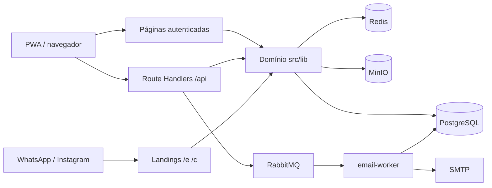
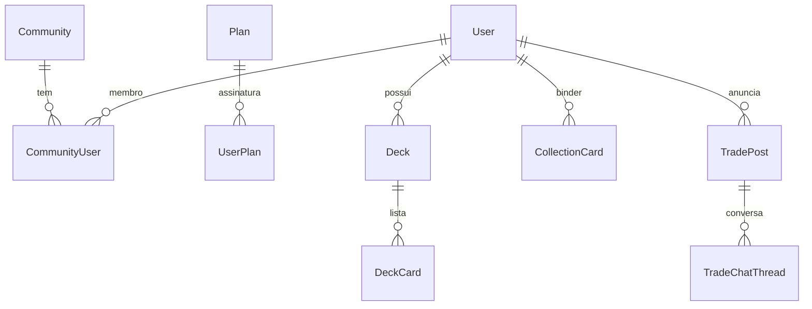
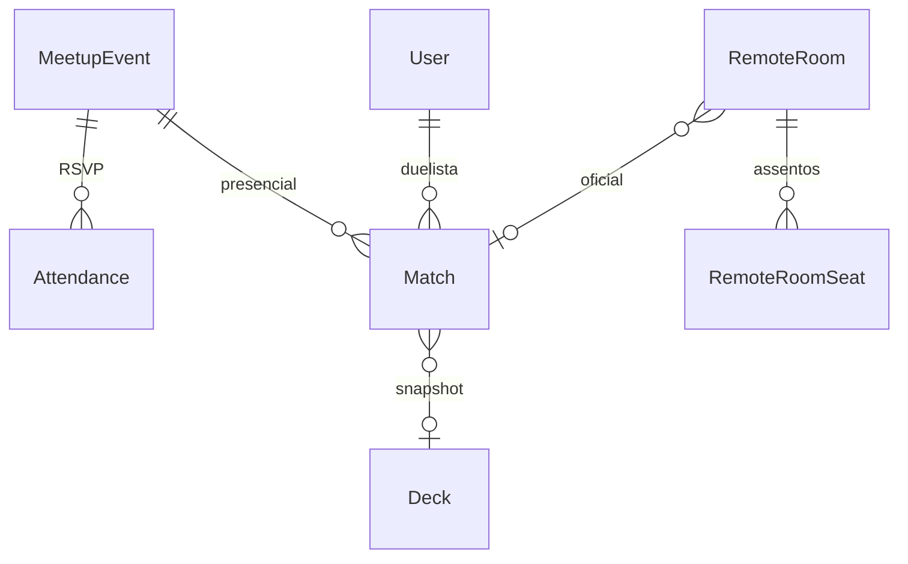
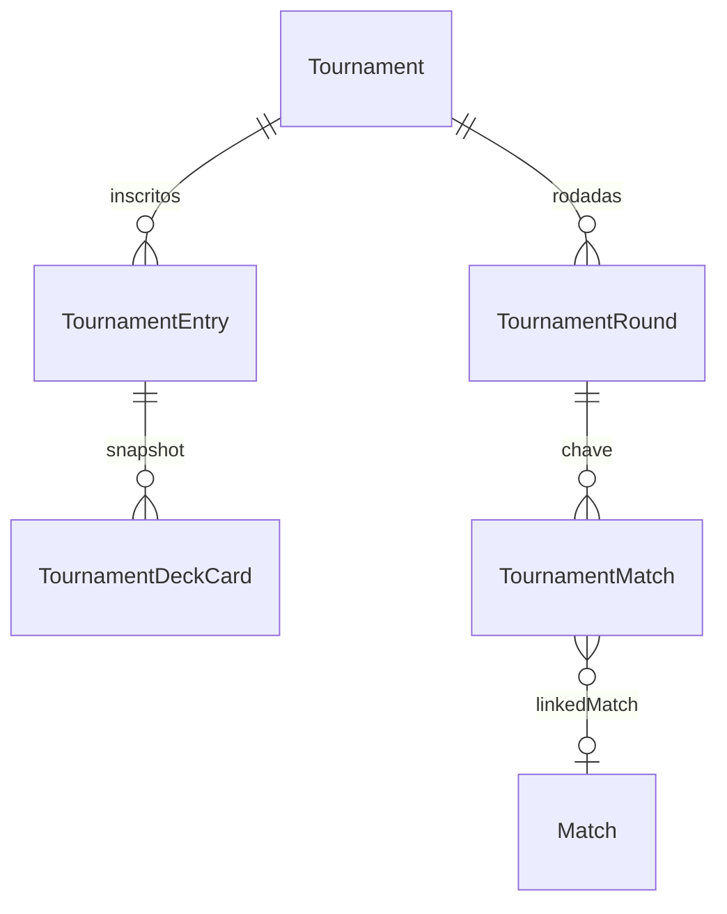
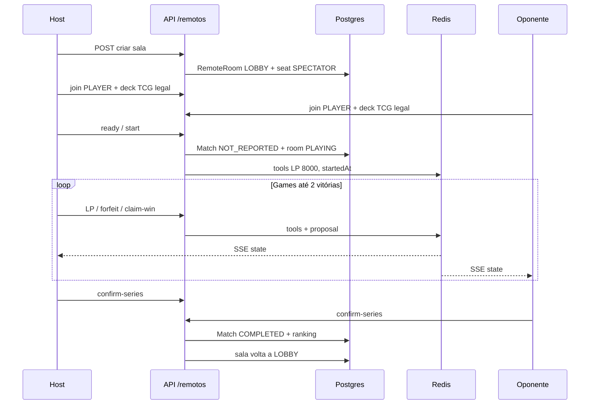

# YGO / HUB

Hub da comunidade de Yu-Gi-Oh! em Cajazeiras-PB. A mesa local combinava sábado no Bob’s, decks, cartas e torneios em conversas de WhatsApp. Entreguei uma plataforma com conta, perfil e histórico — do RSVP do sábado ao bracket do campeonato — para jogador, organizador e quem ainda vai chegar.

- Produção: [yugiohcz.alttabcorp.com.br](https://yugiohcz.alttabcorp.com.br)
- Convite do sábado: [yugiohcz.alttabcorp.com.br/e/sabado](https://yugiohcz.alttabcorp.com.br/e/sabado)
- Repositório: [GitHub](https://github.com/Alttabcorp/yugioh_community)

---

## Resumo do produto

YGO / HUB é um sistema full-stack em produção para a comunidade local. Não é um CRUD de portfólio: a mesa usa no celular, no grupo e na loja.

**Problema.** Presença no sábado, decklist, anúncio de carta, duelo e campeonato viviam em threads. Quem não estava no grupo não existia. Organizador não tinha lista, comprovante nem chave. Resultado de partida não virava ranking.

**Entrega.** Um hub autenticado (PWA) + landings públicas `/e` (evento) e `/c` (campeonato) com Open Graph para WhatsApp e Instagram. Conta por e-mail, Google ou Discord. RSVP, decks TCG, coleção, mercado, partidas presenciais, **salas remotas** (câmera P2P, melhor de 3, confirmação dos dois) e campeonatos com inscrição, banlist, PIX, check-in e pódio.

**Quem usa**

| Papel | O que faz |
|---|---|
| Jogador | Confirma sábado, monta deck, duelá presencial ou remoto, compra/vende, inscreve-se |
| Organizador (plano) | Cria campeonato, aprova inscrição, gera chave, TV do bracket |
| Master | Painel `/admin`: membros, ban, anúncios, reports, planos, auditoria |
| Visitante | Vê convite público sem login; cadastra depois |

---

## O que o sistema faz

- Evento fixo todo sábado no Bob’s, com RSVP e lista de confirmados
- Mural de anúncios para outros encontros presenciais
- Landings públicas `/e` e `/c` para chamar gente no WhatsApp e no Instagram
- Deck builder (main 40–60, extra/side 15, banlist TCG/OCG/GOAT), coleção e importação YDK
- Mercado de venda, troca e procura, com mídia (MinIO), chat, favoritos, alerta e reputação
- Partidas presenciais (registro + confirmação) e **salas remotas**: WebRTC, LP, dado, moeda, BO3
- Histórico, destaques e ranking da comunidade
- Campeonatos: taxa/PIX, decklist travada, check-in, chave, pódio
- Conta, perfil (opt-in LGPD), notificações in-app + e-mail, PWA (Serwist)

Coloque capturas em `fotos/` e referencie aqui, por exemplo: home, RSVP do sábado, deck builder, sala remota ou chave do campeonato.

---

## Arquitetura do sistema

Aplicação Next.js (App Router) no mesmo repositório: UI, Route Handlers e regras de domínio em TypeScript. Persistência em PostgreSQL (Prisma). Estado volátil do duelo e pub/sub em Redis. E-mail assíncrono via RabbitMQ. Arquivos no MinIO (S3). Deploy em Docker (Coolify).



**Regra de dependência.** Páginas e APIs chamam módulos em `src/lib/*`. Prisma e Redis não vazam para componentes de UI. Validação de deck competitiva (`validateDeckForTournament`) é compartilhada entre campeonato e duelo remoto.

### Stack

| Camada | Tecnologia |
|---|---|
| Aplicação | TypeScript, Next.js 16 (App Router), React 19 |
| Auth | Better Auth (e-mail, Google, Discord), papéis por comunidade |
| Dados | Prisma 7, PostgreSQL, adapter `pg` |
| Tempo real | Redis (ioredis), SSE, WebRTC nas salas remotas |
| Filas e e-mail | RabbitMQ, worker `scripts/email-worker.ts`, Nodemailer |
| Arquivos | MinIO / S3 (`@aws-sdk/client-s3`) |
| Cliente | PWA (Serwist) |
| Deploy | Docker Compose (app, email-worker, postgres, redis, rabbitmq, minio) |

Serviços Compose: `app` (porta 3000), `email-worker` (comando `worker`), `postgres`, `redis`, `rabbitmq`, `minio` + `minio-init`. Local: `npm run infra:up` sobe só a infra; `npm run compose:up` sobe o stack.

### Autenticação, papéis e planos

- **Sessão:** Better Auth (`Account`, `Session`, `Verification`).
- **E-mail verificado:** `requireVerifiedEmail` bloqueia mercado, inscrição em campeonato e **assento de duelista remoto**.
- **Ban:** `User.bannedAt` / `banExpiresAt` — `requireAuthenticatedUser` devolve 403.
- **Comunidade:** `CommunityUser.role` = `PLAYER` \| `ADMIN` \| `MASTER`. Organizador de campeonato é capacidade de plano (`canManageTournaments`), não um quarto papel.
- **MASTER:** painel `/admin`, auditoria (`AdminAuditLog`).
- **Planos:** `Plan` / `UserPlan` / `PlanAccessRequest`. Organizador pede liberação; não há cobrança automática. `canManageTournaments` habilita criar campeonato.

O hub autenticado fica separado das páginas públicas de convite. Google e WhatsApp enxergam o evento sem abrir o sistema inteiro.

---

## Modelo de dados (PostgreSQL)

Fonte: `prisma/schema.prisma`. IDs `cuid`. Enums de negócio em `String` (status, formato, papel).

**Identidade, decks e mercado**



**Eventos, partidas e salas remotas**



**Campeonatos**



### Identidade e comunidade

| Modelo | Função |
|---|---|
| `User` | Conta, perfil, opt-in Discord/MD/Omega, prefs de e-mail, ban, soft-delete |
| `Account` / `Session` / `Verification` | Better Auth |
| `Community` | Comunidade (Cajazeiras) |
| `CommunityUser` | Papel PLAYER / ADMIN / MASTER |
| `Plan` / `UserPlan` / `PlanAccessRequest` | Capacidade de organizar torneio |
| `Notification` | Sino in-app |
| `AdminAuditLog` | Ações de master |
| `SiteFeedback` | Feedback do site |

### Eventos e ranking

| Modelo | Função |
|---|---|
| `MeetupEvent` | Sábado / anúncios avulsos |
| `Attendance` | RSVP (CONFIRMED) |
| `Match` | Partida oficial: tipo IN_PERSON/REMOTE, formato, scores, confirmação A/B, snapshot de deck (JSON) |
| `MatchComment` | Comentário na ficha |
| `PlayerFormatRating` | Rating por formato |
| `DuelInvite` / `DuelChatThread` / `DuelChatMessage` | Convite presencial + chat |

`Match.status` / `resultStatus`: pendente, confirmada, cancelada. Vitória oficial só com `winnerId` + scores após acordo (presencial: confirmação; remoto: `confirmSeries` dos dois).

### Decks e cartas

| Modelo | Função |
|---|---|
| `Deck` | Lista do jogador (`format` TCG/OCG/GOAT, `isTournamentCopy`, `archivedAt`) |
| `DeckCard` | PK `(deckId, cardId, section)` MAIN/EXTRA/SIDE |
| `DeckComment` | Comentário público |
| `CollectionCard` | Binder pessoal |

Catálogo de cartas (nome, tipo, imagem) vem de fonte externa / cache de imagens; o banco guarda `cardId` numérico nas listas.

### Mercado

| Modelo | Função |
|---|---|
| `TradePost` | SELL / TRADE / WANT |
| `TradePostMedia` | Fotos no MinIO |
| `TradePostComment` / `TradeReport` / `TradeFavorite` | Social e moderação |
| `TradeChatThread` / `TradeChatMessage` | Negociação |
| `SellerRating` | Reputação |
| `CardWantAlert` | Alerta quando a carta aparece |

### Campeonatos

| Modelo | Função |
|---|---|
| `Tournament` | Formato, bracket, taxa PIX, status OPEN → … → FINISHED |
| `TournamentEntry` | PENDING/APPROVED, comprovante, check-in, swiss, pódio |
| `TournamentDeckCard` | Snapshot da decklist inscrita |
| `TournamentRound` / `TournamentMatch` | Chave; `linkedMatchId` aponta para `Match` |

### Duelo remoto (Postgres + Redis)

**Postgres** guarda a sala durável:

| Modelo | Função |
|---|---|
| `RemoteRoom` | `code` 6 chars, `status` LOBBY/PLAYING/CLOSED, `passwordHash` (scrypt), TTL 6h, `matchId` |
| `RemoteRoomSeat` | PLAYER ou SPECTATOR, lado A/B, deck escolhido, ready |
| `RemoteDuelReport` | Denúncia de conduta |

**Redis** (TTL ~6h, presença 90s) guarda o que não precisa sobreviver ao restart como fonte da verdade da série:

| Chave | Conteúdo |
|---|---|
| `remote:room:{id}:tools` | LP, dado, moeda, games A/B, confirmações da série |
| `remote:room:{id}:proposal` | Pedido cancel / win / undo aguardando o outro |
| `remote:room:{id}:history` | Vitórias e cancelamentos da sala |
| `remote:room:{id}:chat` | Chat de espectador |
| `remote:room:{id}:player:{userId}` | Presença do duelista |
| canal `remote:room:{id}` | Pub/sub → SSE `/api/remotos/rooms/[id]/stream` |

WebRTC é **P2P** (sinalização via SSE `signal`). O servidor não media vídeo.

---

## Módulos de domínio

```
src/lib/
  match-play-rules.ts    # e-mail + ban + deck TCG legal (remoto = campeonato)
  tournament-deck.ts     # estrutura 40–60/15/15 + banlist
  deck-rules.ts          # limites e cópias
  email-gate.ts          # e-mail verificado
  remote-room/           # salas, BO3, propostas, persistência oficial
  tournaments.ts         # campeonato + chave
  match-deck-snapshot.ts # JSON na Match
  community-admin.ts     # sessão, papéis, MASTER
  redis.ts / rabbitmq.ts / email-queue.ts
```

### Regras competitivas (campeonato e duelo remoto)

Participar como **duelista** remoto usa as **mesmas regras de deck e conta** da inscrição em campeonato TCG:

| Regra | Campeonato | Duelo remoto |
|---|---|---|
| E-mail verificado | sim | sim (criar sala, sentar, deck, pronto, start) |
| Conta não banida | sim | sim |
| Formato TCG | formato do torneio | TCG (`COMPETITIVE_PLAY_FORMAT`) |
| Main 40–60, extra/side ≤ 15 | `validateDeckForTournament` | idem |
| Banlist do formato | sim | sim |
| Deck próprio, não arquivado, não cópia de torneio | sim | sim |
| Taxa / comprovante PIX | se o torneio cobra | não |
| Aprovação do organizador | sim | não |
| Check-in / chave | sim | não |

Espectador remoto **não** precisa de e-mail verificado. Organizador e taxa ficam só no módulo de campeonato.

Fluxo remoto: escolher deck → `assertDeckLegalForPlay` → marcar pronto (revalida) → start (revalida os dois decks) → BO3 em Redis → os dois confirmam série → grava `Match` oficial.

---

## Fluxo do duelo remoto



- **Sair no lobby** libera o assento; **fechar o navegador no duelo** mantém o lugar e marca ausência.
- Ausência: esperar, registrar resultado (com confirmação) ou sair (cancela a série).
- Desfazer game e vitória da série pedem o outro jogador.
- Host pode senha, kick e fechar sala. Fechar aba **não** apaga a sala.

Rotas de UI: `/remotos` listagem, `/remotos/[id]` lobby, `/remotos/[id]/duelo` mesa (câmeras + overlays).

---

## Superfície de APIs (visão)

| Área | Exemplos |
|---|---|
| Auth | `/api/auth/[...all]` |
| Perfil / LGPD | `/api/me`, `/api/me/export`, `/api/me/erase`, `/api/profile/*` |
| Decks | `/api/decks`, `/api/decks/for-match` (elegibilidade TCG), cartas, YDK |
| Eventos | `/api/meetups`, RSVP |
| Partidas | `/api/matches`, sala SSE `/api/matches/[id]/room/stream` |
| Remotos | `/api/remotos/rooms`, `/api/remotos/rooms/[id]`, `/stream` |
| Campeonatos | `/api/tournaments`, entries, bracket, check-in, my-decks |
| Mercado | `/api/market`, chats SSE, rating, report |
| Admin | `/api/admin/*` |
| Cron | `/api/cron/reminders`, `/api/cron/retention` |

Rate limit em criar sala, convite, chat e denúncia remota.

---

## Decisões

**Convite público separado do hub.** Quem não tem conta entra pelo link do sábado ou do campeonato, vê o contexto e só então se cadastra. Evitou trancar crescimento atrás do login e deu Open Graph de verdade para o grupo.

**Resultado oficial do duelo remoto só depois dos dois confirmarem.** A melhor de 3 vive na sala (Redis); o registro em `Match` espera acordo. Desfazer um game também pede o outro jogador. Evitou placar “clicado sem querer” virar histórico da comunidade.

**Presença e assento não são a mesma coisa.** Fechar o navegador no meio do duelo mantém o lugar; sair da sala no lobby é outra ação. O oponente vê ausência e escolhe esperar, registrar ou cancelar. A sala não some só porque alguém trocou de aba.

**Mesma legalidade de deck no remoto e no campeonato.** Sem isso, o ranking misturaria lista casual com lista de torneio. Taxa, aprovação e chave continuam só no campeonato.

**Postgres para o que precisa existir amanhã; Redis para a mesa ao vivo.** LP, dado e propostas não merecem migration a cada overlay. A vitória oficial, sim.

**Operação local no celular.** Contraste, RSVP e fluxos curtos importam mais do que um dashboard genérico: o uso acontece no grupo, na mesa e no ônibus até o Bob’s.

---

## Resultado

- Produto no ar em [yugiohcz.alttabcorp.com.br](https://yugiohcz.alttabcorp.com.br), usado pela comunidade de Cajazeiras
- Canal de entrada sem conta: convite do sábado e páginas de campeonato
- Stack e domínio para defender em entrevista: auth, autorização, RSVP, mercado, chave de torneio, duelo remoto (SSE + WebRTC) e regras competitivas compartilhadas
- O que eu faria diferente: métricas explícitas (confirmados no sábado, inscritos no torneio) e testes automatizados nos fluxos críticos (confirmação de série, banlist, RSVP)
